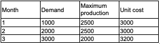

# Problem Statement (Lachtermacher, 2007)
Maria Benz produces passenger cars for the local market and for export to various countries. The first stage of the production process is to manufacture the monoblocks, which are then made available to the production line for assembly of other parts. Maria Benz wants to schedule production for the next three months. The estimated demands, production capacity, and unit production cost for each of the months in question are illustrated in the following table. 

Due to variations in production capacity and manufacturing cost between months, the company can produce some monoblocks one month or more before they are scheduled. The disadvantage is that such monoblocks have to be stored until the month they will be consumed, at a unit storage cost of $ 200.00/month. The production manager wants to know how many monoblocks should be produced each month in order to meet the demand at the lowest possible production and storage cost. Model this issue as a transportation problem and solve it using Solver.

# Objective
Simple example of operations research application. The problem objective is to minimize the production cost.

# Solution
You can access the problem solution [here](Atividade0_1_MQG.ipynb).
